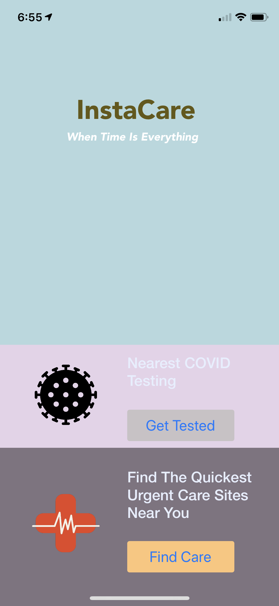
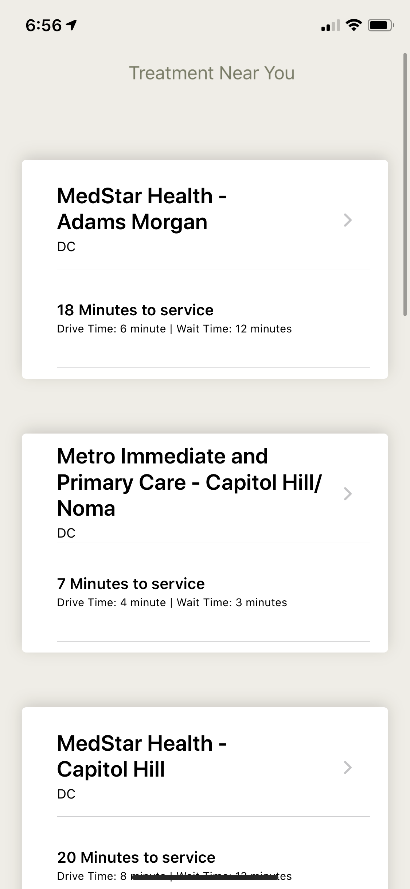
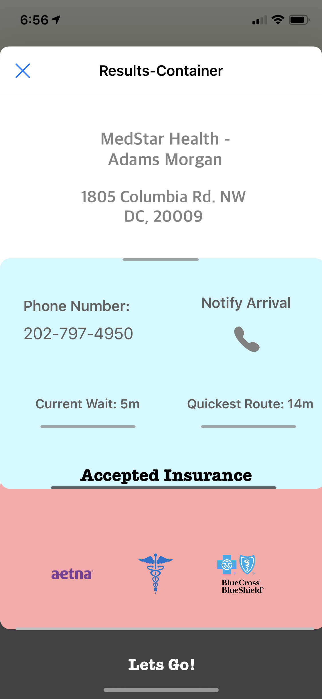
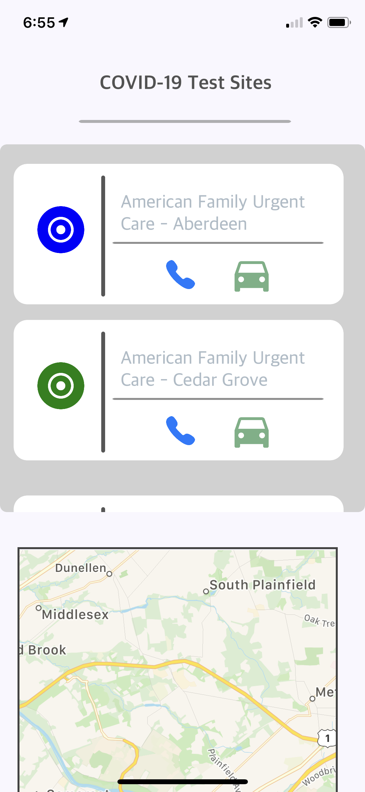
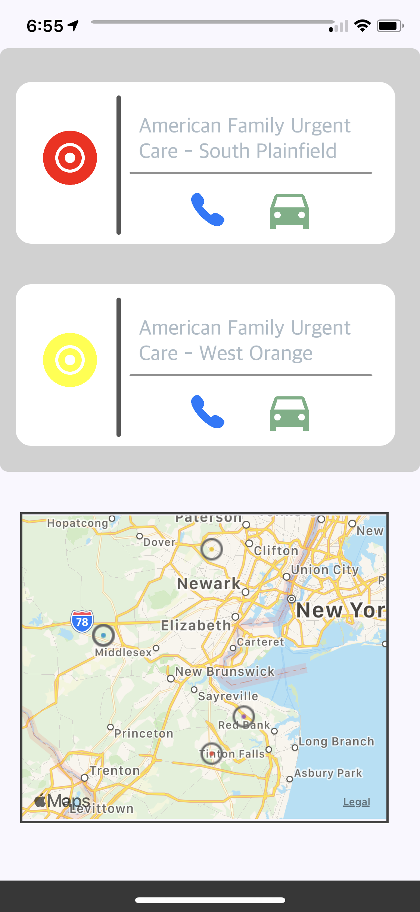

# COVID Health
[![Made with SwiftUI]](https://seeklogo.com/images/S/swift-logo-7927855EB5-seeklogo.com.png)
[legal](legal.md)

App to help users efficiently find and get to medical help

## iOS App

|        |          |   |   |   |
| :-------------: |:-------------:| :-----:|:-----:|:-----:|
| Landing Page    | Care Results  | Care Details | COVID Testing Results | COVID Testing Map |

This app was developed (almost) entirely in Python using PyUI and Pythonista on iOS. It runs locally on the user's device, serving information using a number of structured API calls rather than relying on a remote server to retrieve and return information. For technical details on how this information is retrieved and processed, as well as more info about our data collection and structuring techniques, [see here](docs/dataStructures.md).

## Action Items (more info on the [project board](https://github.com/orgs/gw-innovation-lab/projects/1))
 * ~~Baseline proof of concept~~
 * ~~Implement interface to test code flexibility~~
 * ~~Bolster (useful) information output~~
<!--- * ~~Develop visual interface (app): iOS and Android | Pythonista (?)~~ -->
 * ~~Obtain more immediate and accurate wait times~~
 * Beautify app interface (possibly new color scheme, etc.)
 * Work directly with local medical providers (first-party APIs?)
